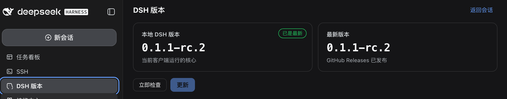

# dsh-version

**[English](README.md) | [中文](README.zh.md)**

A DSH (DeepSeek Harness) Web GUI plugin that inspects and updates the installed
DSH core. The sidebar panel shows exactly two numbers — the **local DSH
version** (the `@deepseek-ai/dsh` core the running client actually uses) and
the **latest published version** (GitHub Releases first, npm dist-tags as
fallback) — polls on a configurable schedule (default every 3 hours), and
offers a "Check now" button plus an update button that upgrades the profile's
core packages to the detected version.

Hot-pluggable: mounted via `dsh plugin --profile <name> add link:<path>`, no
DSH source changes required.

## Screenshot

The sidebar "DSH 版本" panel in the dsh web GUI: local vs. latest version
cards, the status badge, and the Check/Update actions.



## Features

- **Local version**: probed from the runtime tree the GUI actually runs
  (the profile npm install), so the number always matches the running SDK.
- **Latest version**: fetched from the dsh GitHub Releases API
  (`repos/deepseek-ai/deepseek-harness/releases`); when that is unreachable,
  the highest of the npm `latest`/`next` dist-tags
  (`…/-/package/@deepseek-ai/dsh/dist-tags`) is used — the `latest` tag lags
  behind because rc releases ship under `next`. Cached on a configurable
  schedule (default 3 h, 1 min … 1 week, editable in Settings → Plugins →
  dsh-version), with a manual "Check now" button.
- **Update button**: two-step confirmation (no separate dialog); runs
  `pnpm add @deepseek-ai/dsh@<detected> @deepseek-ai/dsh-base@<detected>
  @deepseek-ai/dsh-web-app@<detected>` (npm fallback) in the profile directory
  and shows a success/failure banner. **Restart `dsh web` for changes to take
  effect.**
- **Loopback-only API**: the `/api/dsh-version/*` routes are only reachable
  from the local machine — never exposed on the LAN.

## Requirements

- A running DSH web GUI deployment (`dsh web`, or `pnpm --profile web`), with
  `~/.dsh/profiles/<name>` installs.
- Node.js `^22.19.0 || >=24.0.0` (to build from source; the plugin itself runs
  inside the dsh host).
- `pnpm` on `PATH` for the update runner (npm is used as fallback).

## Install

**From GitHub (recommended for everyone else).** The git install fetches the
source and runs the package's self-contained `prepare` build (tsdown), so no
prebuilt artifacts are shipped:

```sh
dsh plugin --profile web add github:MrWinchester/dsh-version-control
```

pnpm ≥ 10 refuses to run a git dependency's `prepare` script until authorized.
The first `add` prints the build-authorization key for this package — copy the
exact key it prints into the profile's `pnpm-workspace.yaml`, then re-run the
`add` command:

```yaml
# <profile>/pnpm-workspace.yaml
allowBuilds:
  '@mrwinchester/dsh-version': true
```

```sh
dsh plugin --profile web add github:MrWinchester/dsh-version-control
# restart dsh web to load the plugin
```

For reproducible installs, pin the commit:

```sh
dsh plugin --profile web add 'github:MrWinchester/dsh-version-control#<full-sha>'
```

**Local source link (for development).** Mount the checkout directly:

```sh
dsh plugin --profile web add link:/path/to/dsh-version-control
# restart dsh web to load the plugin
```

The plugin appears as a "DSH 版本" entry in the sidebar of the web GUI. The
bundle patch (`cordis.patch.yml`) and the `dsh.client` declaration in
`package.json` make both halves (host + browser) load automatically.

To uninstall:

```sh
dsh plugin --profile web remove dsh-version
```

## Usage

1. Open the web GUI and click the sidebar "DSH 版本" entry to open the panel.
2. The panel shows the local version, the latest version, the last check time,
   and the polling interval.
3. Click **Check now** to force a re-check against GitHub Releases / npm.
4. When a newer version is detected, click **Update** and confirm the two-step
   dialog. The plugin runs the package manager inside the profile directory
   and shows a success/failure banner. **Restart `dsh web` afterwards.**

## API

All routes are loopback-only and return JSON.

| Method | Path | Description |
|---|---|---|
| `GET` | `/api/dsh-version/status` | Local/latest versions, checking state, schedule, update state |
| `POST` | `/api/dsh-version/refresh` | Kick an immediate version re-check |
| `POST` | `/api/dsh-version/update` | Start the profile update (loopback only) |

## Configuration

The plugin reads a settings namespace `dsh-version` (Settings → Plugins →
dsh-version) with the following fields:

| Field | Type | Default | Description |
|---|---|---|---|
| `checkIntervalMinutes` | number | `180` | Polling interval in minutes (1 … 10080). The running poller re-arms on change. |
| `announceToAgent` | boolean | `true` | Add a system-prompt section announcing the plugin to agents. |
| `enabled` | boolean | `true` | Master switch for routes, poller, and the prompt section. |

## Security model

- The update action **really rewrites** `~/.dsh/<profile>` dependencies
  (`pnpm add …@<version>`). The two-step button confirmation is the user's
  consent gate.
- No `/api/dsh-version/*` endpoint is served to non-loopback clients; the
  loopback fence checks the socket address, the `Host` header, and browser
  same-origin markers, and never trusts `X-Forwarded-For`.
- Version lookups never fail silently: when GitHub Releases and npm dist-tags
  are both unreachable, the previous value is kept and the latest version
  shows `--` with a failure hint.

## Development

```sh
pnpm install         # install devDependencies (official @deepseek-ai SDK packages)
pnpm test            # vitest: versions/helpers/store unit tests
pnpm typecheck       # tsc --noEmit
pnpm build           # tsc declarations + tsdown dual-face artifacts (lib/ + lib/client.js)
```

The build is self-contained: types resolve from the official
`@deepseek-ai/*` npm SDK packages declared in `devDependencies`, never from a
DSH source checkout. The `shared/` directory (tsdown client preset +
`web-platform.ts`) is vendored here for the standalone build.

### Layout

```
src/                    host half: version probe, registry poller, routes, update runner
src/client/             browser half: sidebar entry + version panel (web GUI)
src/protocol.ts         wire contract shared by both halves
src/loopback.ts         loopback trust fence (shared with the dsh-web-ui family)
src/mount-once.ts       single-instance guard
tests/                  unit tests (framework-free version helpers, store)
shared/                 vendored tsdown client-bundle preset + platform module list
cordis.patch.yml        bundle patch inserting the plugin row into the profile
```

### Package identity

Install identity is `@mrwinchester/dsh-version` (npm scopes are lowercase;
the GitHub username `MrWinchester` and the package scope are independent).
The package name is the install identity and appears in several files — when
renaming, update **all** of them or the profile dependency and plugin
registration will disagree:

- `package.json` → `name`
- `src/index.ts` → `PLUGIN_PACKAGE` and the `mountOnce` argument
- `cordis.patch.yml` → the plugin row `name`
- `tsdown.config.ts` → the first `clientBundle` argument (the id is stamped
  into `__ModuleLoader__.load` and the injected style tags)
- `tests/versions.test.ts` → fixture dependency names (incl. the counter-package)
- this file, `README.zh.md`, and `AGENTS.md` → install identity / `allowBuilds` keys

After renaming, reinstall into any mounted profile (`remove` the old name,
then `add` the new one).

## License

Apache-2.0 — see [LICENSE](LICENSE).